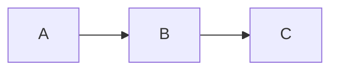
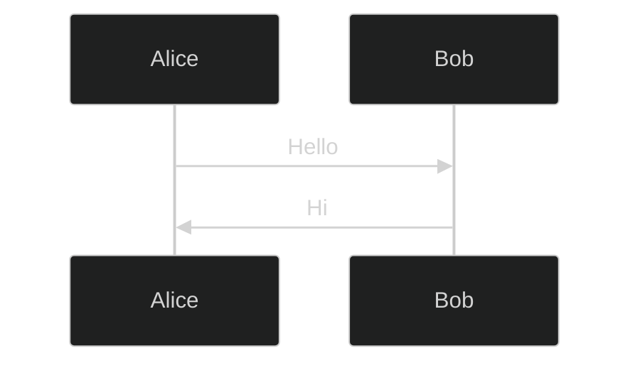

# Diagrams

Prose before the first diagram.

```mermaid
flowchart LR
A --> B
B --> C
```

Prose between diagrams.

```mermaid
%%{ init: { 'theme': 'dark' } }%%
sequenceDiagram
Alice->>Bob: Hello
Bob->>Alice: Hi
```

```mermaid
weirdDiagram
stuff that no renderer understands
```

Prose after the last diagram.
