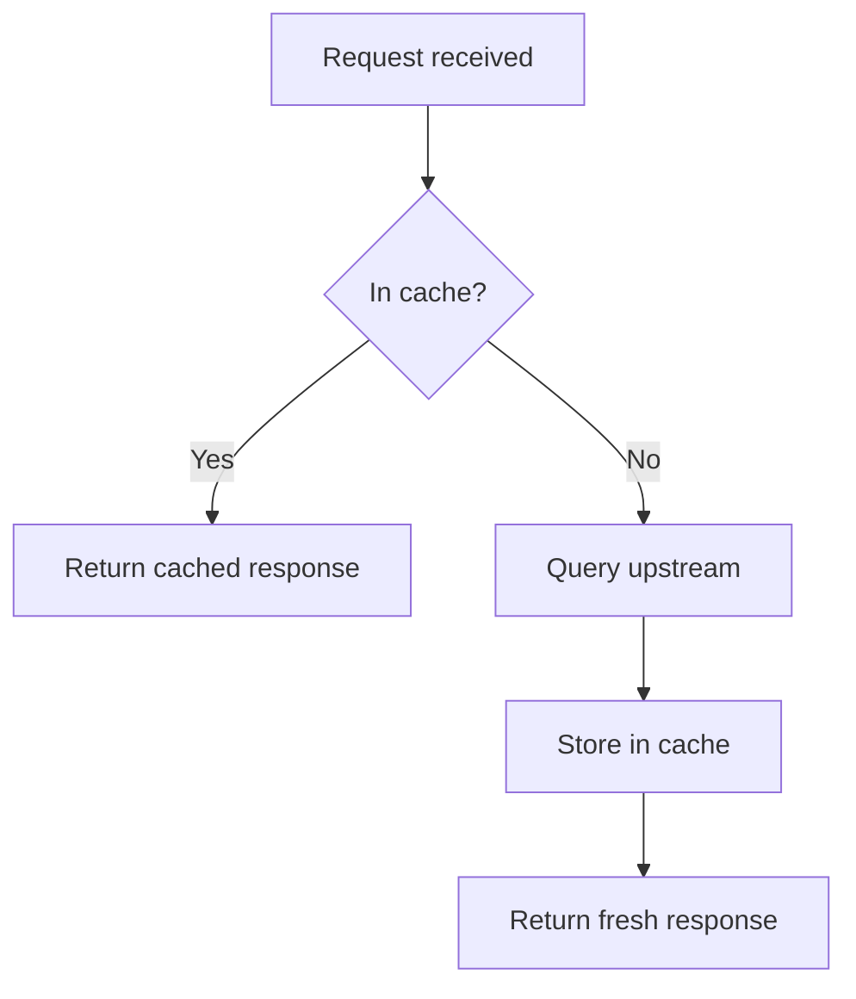
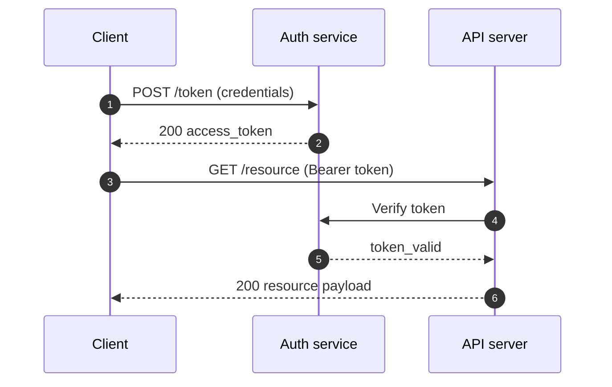
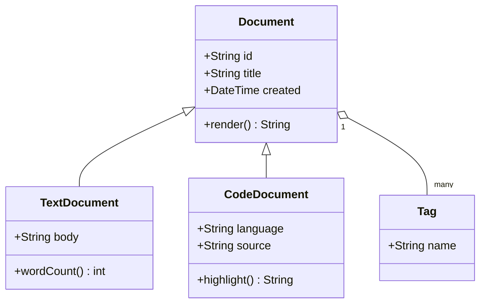
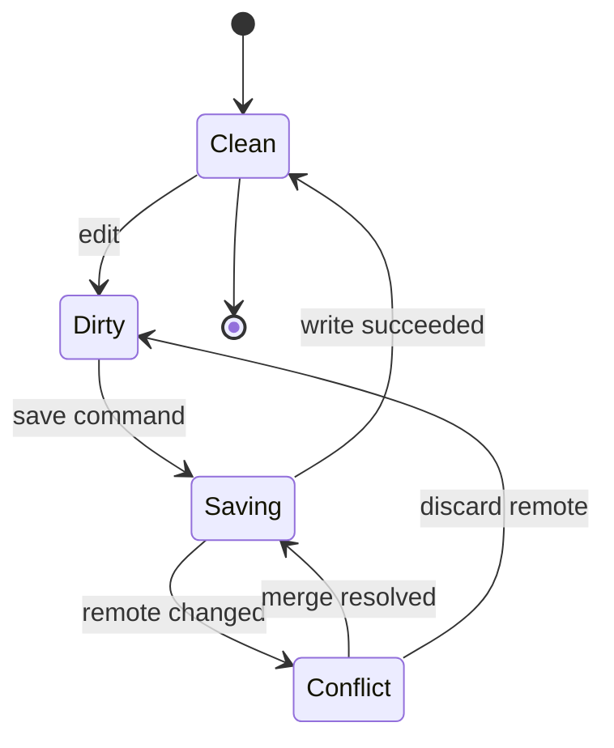
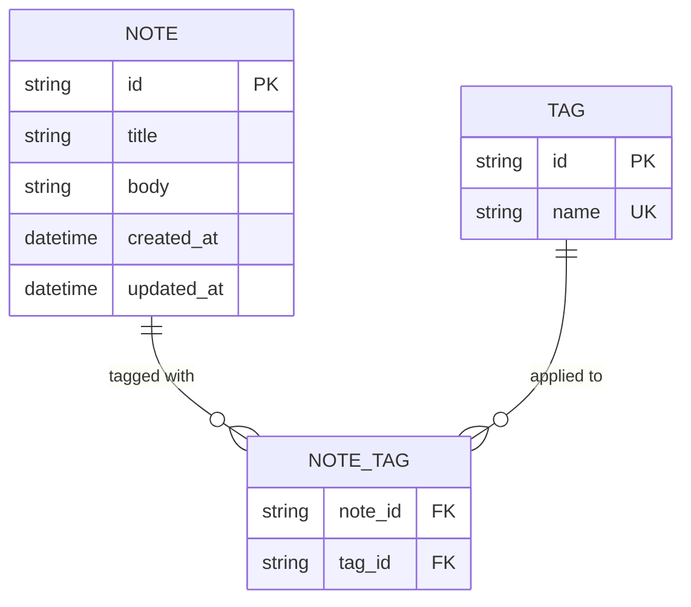
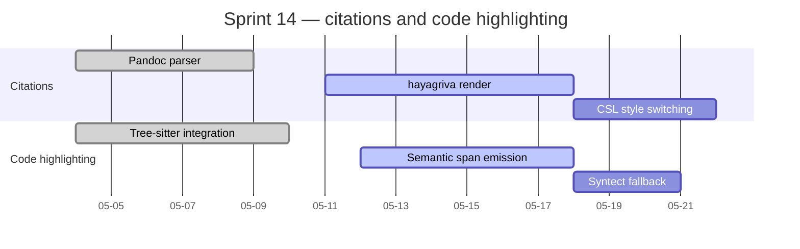
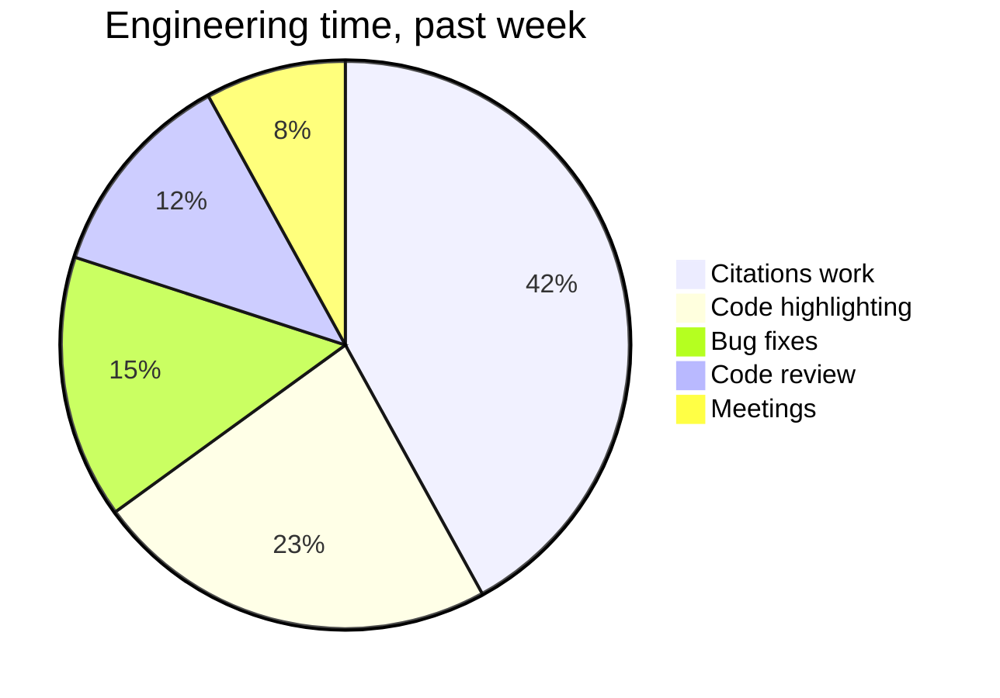

# Mermaid sampler

A single note exercising seven of the Mermaid diagram types that Slate's K-milestone pipeline supports. Each diagram is preceded by a one-sentence framing so the structured-description has context to work from, and every diagram has a title where the syntax allows.

## flowchart

A minimal request/response flowchart with one decision point, useful as the baseline shape against which the other diagram types contrast.

## sequenceDiagram

A short interaction between three participants showing the temporal ordering of an authenticated API call.

## classDiagram

A small class hierarchy for a notional document model, showing inheritance, composition, and a couple of method signatures.

## stateDiagram-v2

The lifecycle of a single editable note, showing the transitions between unsaved, saved, and conflict states.

## erDiagram

The minimal relational schema behind a notes app: notes, tags, and the many-to-many join between them.

## gantt

A short delivery timeline for the milestones in the current development sprint.

## pie

A breakdown of where the past week's engineering time actually went, useful mostly as a sanity check on the calendar.

