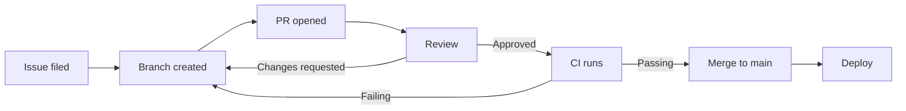

# Software process

A short reference diagram of the team's everyday change-management flow, from an issue being filed through to a deploy reaching production. The flow is deliberately conventional — nothing exotic — because the value of having it written down is consistency, not novelty.

A few notes on the diagram. The two feedback loops — review-requesting-changes and CI-failing — both return to the branch node rather than the PR node, because in practice the developer pushes new commits to the existing branch and the PR updates in place; a new PR is rare. The decision diamond is implicit in the labeled edges out of the review node, which is the conventional Mermaid shorthand for a yes/no fork.
