# Mermaid architecture diagrams for the accessible Obsidian-compatible Flutter proposal

Generated as standalone Mermaid `.mmd` files plus this combined Markdown reference.

## How to use

- Open the `.mmd` files in any Mermaid-compatible editor or renderer.
- Open this Markdown file in a renderer that supports Mermaid fenced code blocks.
- The plain-language descriptions before each diagram are intentionally included so the document remains useful even when the diagram is not rendered or is being read with a screen reader.

## Diagram inventory

- `01_system_context.mmd` — System context
- `02_core_layered_architecture.mmd` — Core layered architecture
- `03_vault_metadata_pipeline.mmd` — Vault metadata pipeline
- `04_accessibility_ui_architecture.mmd` — Accessibility UI architecture
- `05_plugin_compatibility_runtime.mmd` — Plugin compatibility runtime
- `06_bases_engine.mmd` — Bases engine
- `07_graph_engine.mmd` — Graph engine
- `08_livesync_compatible_sync.mmd` — LiveSync-compatible sync
- `09_phase_0_phase_1_roadmap.mmd` — Phase 0 and Phase 1 roadmap
- `10_core_data_model_er.mmd` — Core data model ER diagram
- `11_plugin_event_lifecycle_sequence.mmd` — Plugin event lifecycle sequence
- `12_canvas_accessibility_architecture.mmd` — Canvas accessibility architecture

## System context

**Description:** Shows the proposed accessible Flutter vault client at the center of the ecosystem. Users interact with the app through screen readers, keyboard, voice control, pointer, or touch. The app opens existing Obsidian-compatible vaults, exposes built-in golden-plugin features, optionally runs a selective plugin compatibility layer, and can connect to open sync adapters including a LiveSync-compatible path.

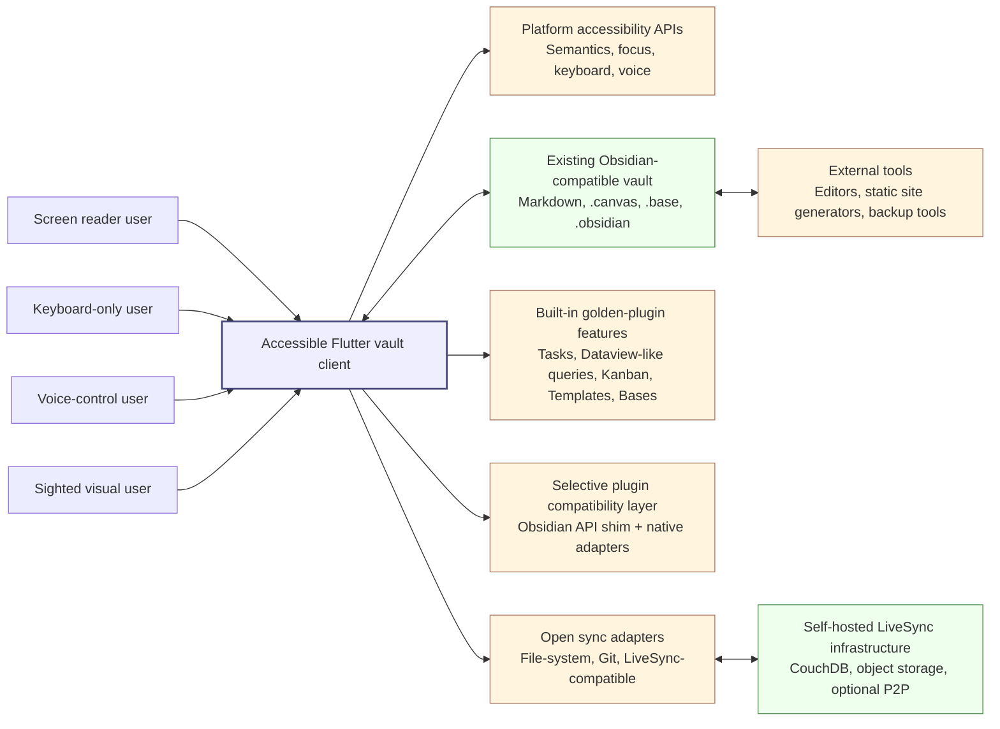

## Core layered architecture

**Description:** Shows the proposed app as five layers: accessible Flutter UI, application services, vault intelligence, persistence, and interoperability. The key architectural idea is that visual features, accessible renderers, plugins, sync, and search all depend on the same metadata and vault intelligence layer.

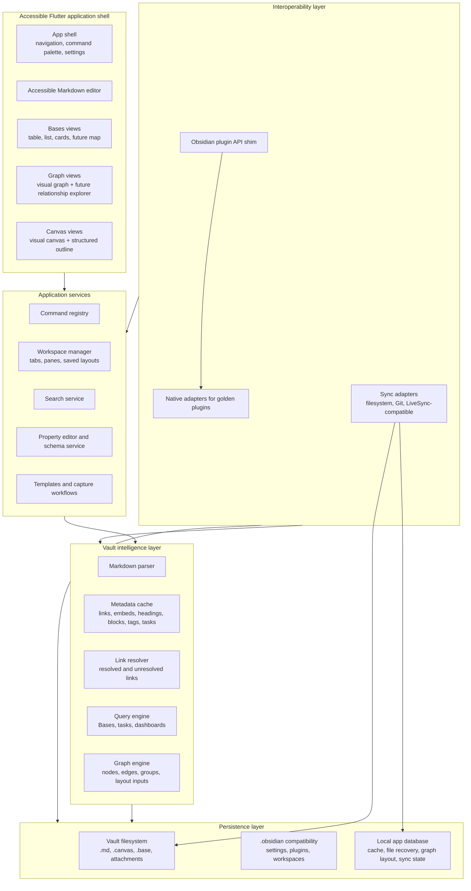

## Vault metadata pipeline

**Description:** Shows how a file event becomes file-state records, parsing work, metadata cache updates, link resolution, and downstream features such as Search, Backlinks, Outline, Bases, Graph, and plugin APIs.

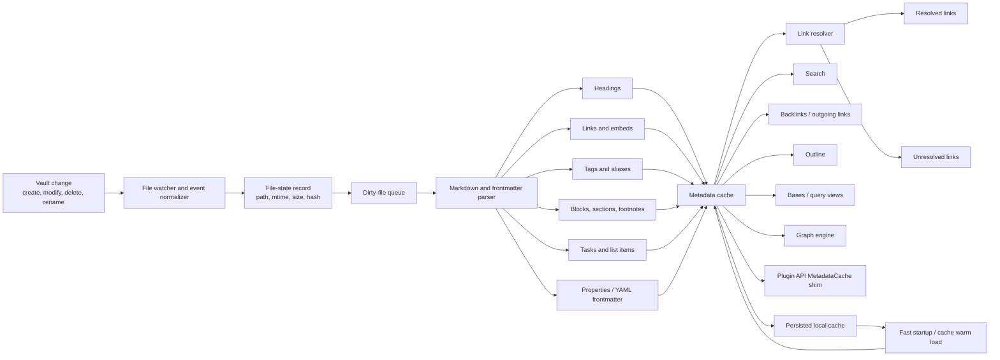

## Accessibility UI architecture

**Description:** Shows the accessibility-first UI approach: all input modes flow through focus, semantics, shortcuts, native widgets, and status announcements before reaching feature renderers. The validation layer includes screen-reader, keyboard-only, voice-control, and automated semantics testing.

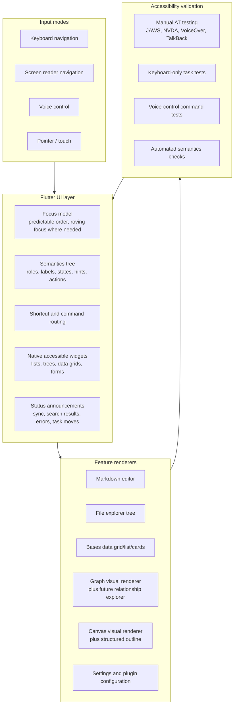

## Plugin compatibility runtime

**Description:** Shows how plugin packages are classified into compatibility tiers, routed through a sandboxed JavaScript runtime and Obsidian API shim when feasible, or handled through native adapters and explicit permission gateways when not feasible.

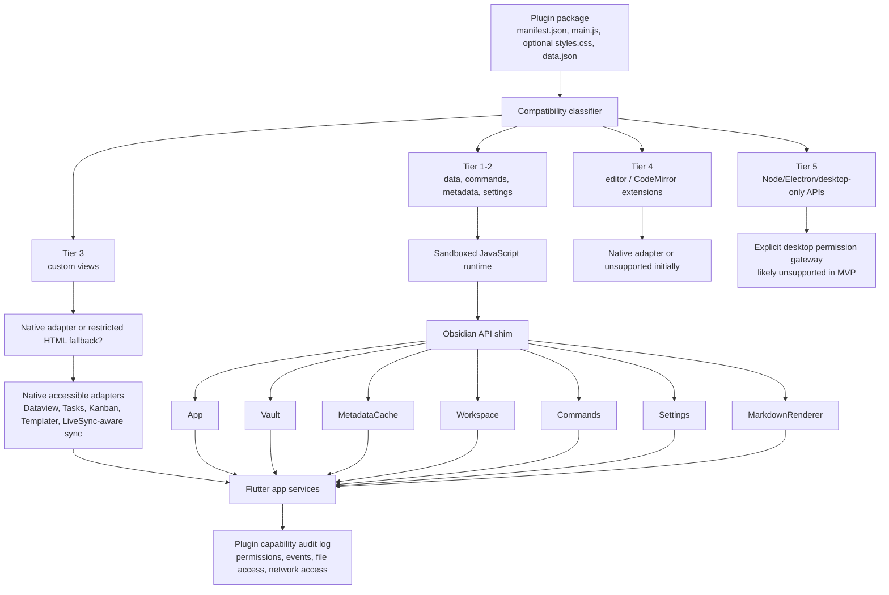

## Bases engine

**Description:** Shows Bases as a structured query platform over vault metadata and .base files. The output is a result model that can render as accessible tables, lists, cards, maps, exports, and plugin/API surfaces.

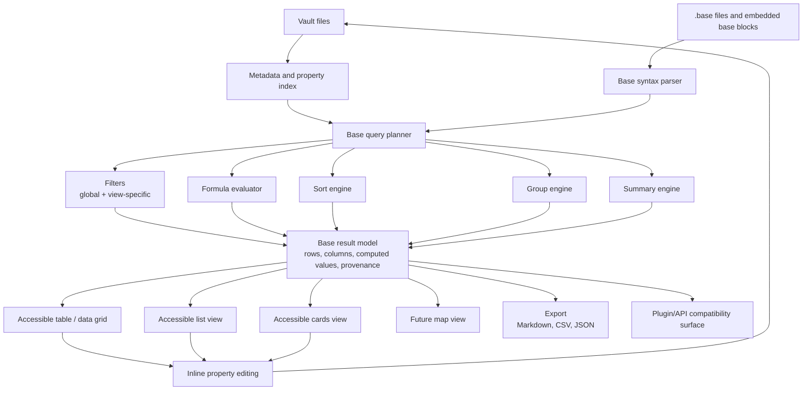

## Graph engine

**Description:** Shows Graph as a renderer-agnostic data pipeline: metadata becomes graph nodes, edges, and metrics; filters and presets produce result sets; a layout engine feeds both a visual Flutter graph and future accessible graph modes such as graph table, relationship explorer, path finder, and cluster navigator.

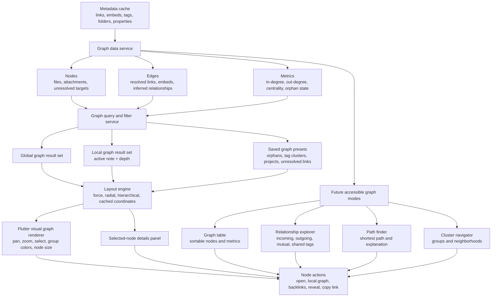

## LiveSync-compatible sync

**Description:** Shows the proposed native sync adapter path: vault watcher, local sync queue, local sync database, encryption layer, LiveSync-compatible replicator, and backends such as CouchDB, object storage, and optional P2P. It also includes safe coexistence, settings import, status UI, and conflict handling.

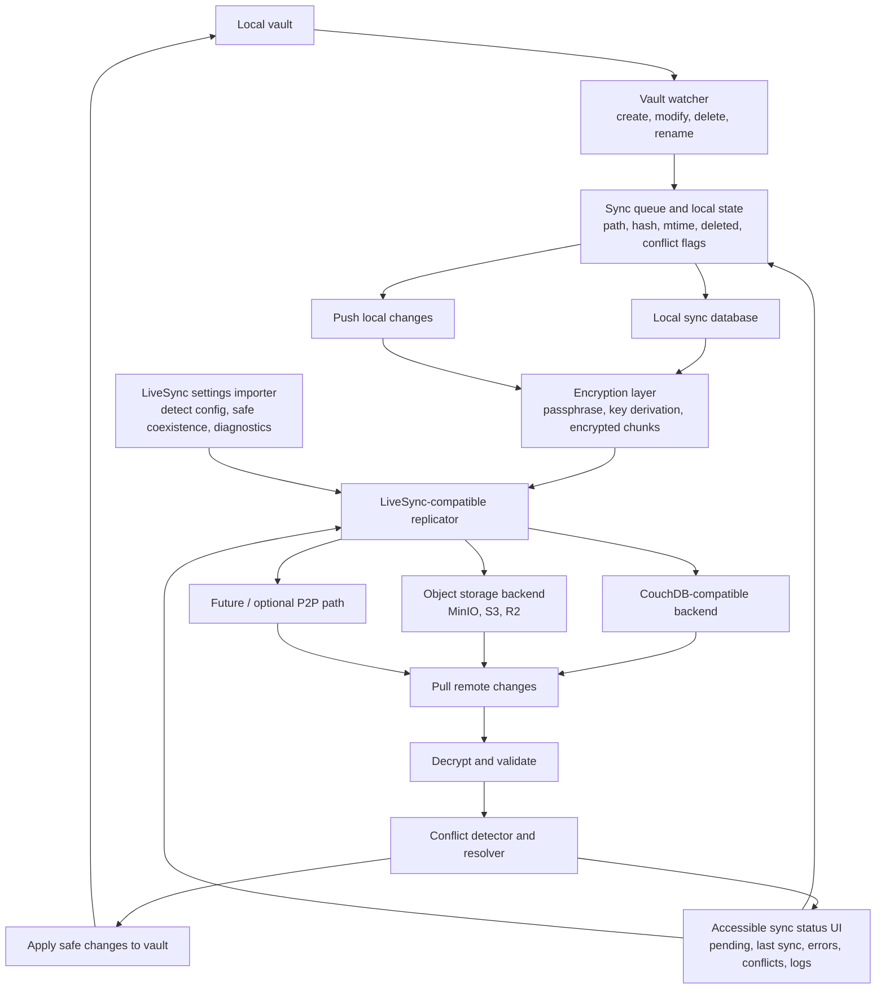

## Phase 0 and Phase 1 roadmap

**Description:** Shows Phase 0 as validation, evidence consolidation, compatibility contracts, accessibility requirements, and technical spikes. Phase 1 then builds the usable alpha foundation: vault support, metadata engine, accessible editor/navigation, Bases MVP, Graph MVP, golden built-ins, and sync coexistence.

```mermaid
flowchart LR
  P0Start["Phase 0 start<br/>definition and validation"] --> P0A["Evidence consolidation<br/>docs, bundle trace, demo vault, plugins, IndexedDB"]
  P0A --> P0B["Compatibility contract<br/>vault files, .obsidian, plugin tiers, sync boundaries"]
  P0B --> P0C["Accessibility requirements<br/>screen reader, keyboard, voice-control acceptance tests"]
  P0C --> P0D["Technical spikes<br/>Flutter editor, metadata parser, Bases parser, graph prototype, LiveSync settings parser"]
  P0D --> Gate0{"Phase 0 gate<br/>buildable MVP scope?"}

  Gate0 --> P1A["Phase 1 foundation<br/>vault open/save, file explorer, settings import"]
  P1A --> P1B["Metadata engine<br/>parser, index, links, tags, properties, tasks"]
  P1B --> P1C["Accessible editor and navigation<br/>command palette, quick switcher, outline, backlinks"]
  P1C --> P1D["Bases MVP<br/>.base parser, table/list views, filters, sort, property editing"]
  P1D --> P1E["Graph data engine + visual MVP<br/>global/local graph, filters, groups, node actions"]
  P1E --> P1F["Built-in golden features<br/>Tasks, templates, Kanban-compatible boards, Dataview-like query views"]
  P1F --> P1G["Sync MVP<br/>safe coexistence, filesystem sync awareness, LiveSync config import"]
  P1G --> Gate1{"Phase 1 gate<br/>usable accessible alpha?"}
```

## Core data model ER diagram

**Description:** Shows the proposed local data model: files, metadata records, property values, links, tags, headings, blocks, tasks, Bases, graph nodes, and graph edges.

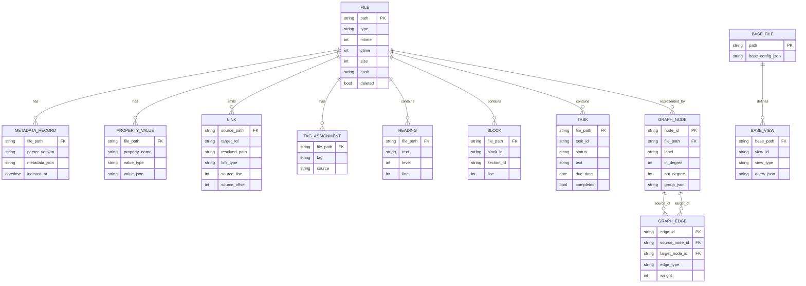

## Plugin event lifecycle sequence

**Description:** Shows the proposed lifecycle for loading a compatible plugin, giving it API objects through the shim, registering commands/events/views, responding to vault and metadata events, routing output to native accessible renderers, and unloading cleanly.

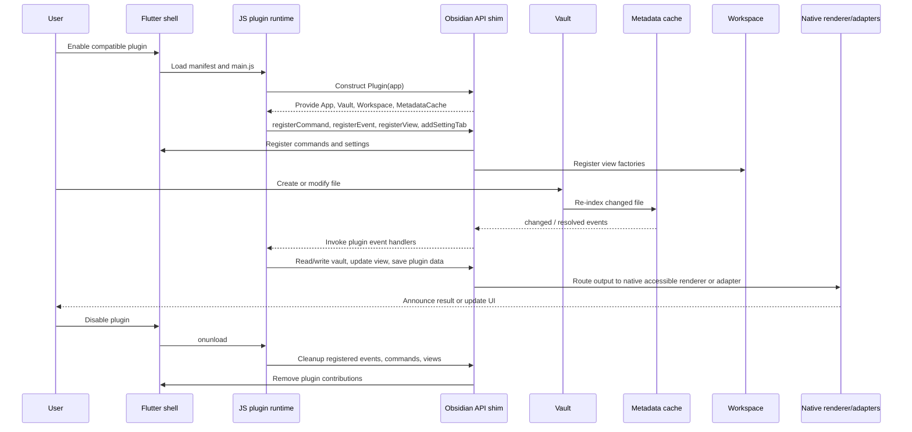

## Canvas accessibility architecture

**Description:** Shows Canvas support as a parser and model over .canvas JSON, with separate visual, outline, table, and keyboard-navigator renderers that share actions and serialize back to the canvas file.

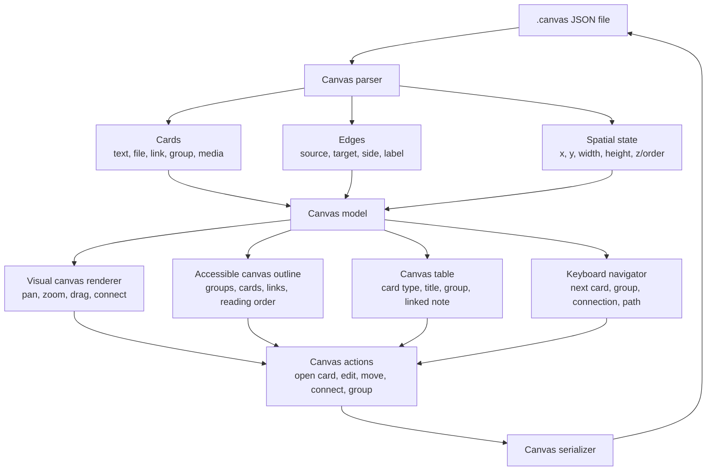
