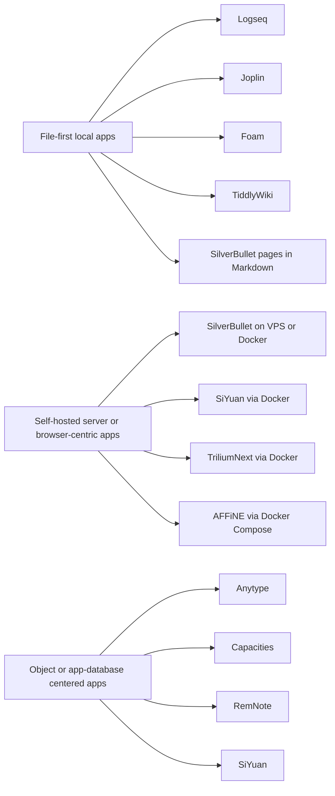

# ObsidianMD Competitor Landscape

## Executive Summary

For a user who values **local ownership, markdown portability, and self-hostability**, the strongest alternatives to Obsidian today split into four meaningful groups. The **closest open-source replacements** are **Logseq**, **SilverBullet**, **SiYuan**, and **TriliumNext**. Logseq is the most natural fit for users who already think in linked notes and outlines and want plain-text Markdown or Org files; SilverBullet is the most compelling if you want a **browser-based, self-hosted** Markdown wiki with deep programmability; SiYuan is one of the most feature-complete **privacy-first self-hosted PKM systems** but is more block- and database-centric than a classic vault; TriliumNext is excellent for very large personal knowledge bases, though it diverges more sharply from Obsidian’s file-on-disk model. citeturn7view1turn7view2turn7view3turn7view4

If your priority is **security, sync robustness, and conservative note-taking rather than graph-centric PKM**, **Joplin** is the safest recommendation. It is offline-first, supports end-to-end encryption, offers multiple sync targets, and has a mature plugin and theme system, but it is not as graph-native as Obsidian or Logseq. If your priority is **programmability and publishing through Git or static hosting**, **Foam** remains one of the best choices for technical users already comfortable inside VS Code. If your priority is a **single-file or ultra-long-lived personal wiki**, **TiddlyWiki** is uniquely durable and self-sovereign, though it is less turnkey as an “Obsidian drop-in.” citeturn7view0turn18view0turn7view5

Among non-open alternatives, the most serious competitors are **Anytype**, **Capacities**, and **RemNote**. Anytype is the strongest privacy-first proprietary-adjacent option because it is **local-first, peer-to-peer, and end-to-end encrypted**, with support for running on a self-hosted network. Capacities is one of the best-documented polished closed products, but it is explicitly **cloud-based** and stores live data in-app rather than as Markdown on disk. RemNote is the best pick if your workflow mixes PKM with **spaced repetition, PDFs, and study-heavy linking**, and it now has an official Obsidian import path, but it is not a self-hosted or markdown-native system. citeturn7view7turn21search10turn11search13turn11search19turn22search2turn23search1

The broad conclusion is straightforward: **if you want the closest philosophical substitute for Obsidian, start with Logseq or SilverBullet; if you want the strongest self-hosted all-in-one PKM feature set, look hard at SiYuan; if you want the most conservative privacy-focused notes app, choose Joplin; if you can accept a non-Markdown object model for a more ambitious product, Anytype and Capacities are the strongest premium-era alternatives.** citeturn7view1turn7view2turn7view3turn7view0turn7view7turn11search19

## Methodology and Evaluation Lens

This report prioritizes **official project sites, official documentation, official GitHub repositories, official release pages, and official help centers**. Community discussion, third-party reviews, and app-store pages were only used sparingly, and mainly when official public documentation was thin or a client/platform statement was easier to verify there. All community metrics and release references reflect the sources retrieved on **May 16, 2026**. citeturn12search1turn7view0turn7view2turn7view3turn7view4turn8search1turn21search4turn2search1turn22search5

The comparison criteria follow your requested axes: **license/source model; self-hosting support and deployment modes; sync model; storage model; plugin or extension ecosystem; documentation quality; feature coverage relative to the comparison set you specified; community activity; security/privacy posture; migration friction from Obsidian; and major pros/cons**. Two caveats matter. First, some official GitHub pages did **not surface exact contributor counts** through the crawler, even when contributor sections clearly existed, so I sometimes report contributor activity qualitatively rather than pretending precision I could not verify. Second, a few exact SPDX license strings were not visible in the retrieved lines for some projects even though they are open-source projects; where that happened, I mark them conservatively as **open source** rather than asserting an uncited license code. citeturn13view0turn13view1turn16view2turn16view3turn16view5

## Shortlist Comparison Table

**Legend for feature fit:** `G` graph view, `B` backlinks / bidirectional linking, `LF` local-first, `E2EE` end-to-end encryption, `T` templates, `S` search, `Clients` desktop/mobile/web.

| Candidate | Source model | Self-host and deployment | Storage and sync | Extensibility | Feature fit | Docs, community, migration, and notes |
|---|---|---|---|---|---|---|
| **Logseq** | Open source; AGPL-3.0 surfaced in official GitHub org output | Desktop and mobile apps; no server-style self-host deployment surfaced in the retrieved official docs, so practical hosting is your local graph plus your own file-sync layer | Plain-text **Markdown/Org-mode** files; strongly local-first | Strong plugin and theme ecosystem; dedicated marketplace repo | `G ✅ B ✅ LF ✅ E2EE —/unclear in retrieved docs T ✅ S ✅ Clients: D+M, no public web app` | Docs are good and navigable; GitHub shows **42.8k stars** and active updates; migration from Obsidian is relatively easy because existing Markdown graphs are a first-class entry path. Main trade-off: excellent local graph experience, weaker story for browser/web and formal self-host/server operation. citeturn12search1turn7view1turn12search8turn12search5turn13view1 |
| **Joplin** | Open source | Desktop, mobile, and official **Joplin Server** for self-hosting; README for server package is public | Markdown notes, offline-first, sync to **Nextcloud, Dropbox, OneDrive, Joplin Cloud**, and others; supports **E2EE** | Mature plugin and theme support | `G — native B △ not a core headline feature LF ✅ E2EE ✅ T △ S ✅ Clients: D+M` | Excellent official docs; GitHub shows **54.8k stars** and a very large contributor roster; releases are active, with **v3.6.13 on May 12, 2026**. Migration from Obsidian is easy if your vault is mostly Markdown, but you lose graph-native workflows unless you rebuild them with plugins. citeturn7view0turn0search13turn19view0turn13view0turn0search5 |
| **SilverBullet** | Open source; MIT | Self-hosted, browser-based PKM; suitable for Docker/VPS-style deployment and reachable through a browser | Markdown pages in a “Space”; sync is implicit through the hosted server rather than a separate sync service | Very strong programmability through **Space Lua**, commands, templates, widgets, and libraries | `G △ no official graph headline B ✅ LF △ server-first rather than device-first E2EE — T ✅ S ✅ Clients: Web-first` | Docs are solid; GitHub shows **5.3k stars**; release messaging indicates a roughly monthly cadence. Migration from Obsidian is good for Markdown-centric users, especially those who want a web UI without surrendering self-hosting. Biggest con: less local-device-native than file-first tools. citeturn7view2turn16view2turn0search10 |
| **SiYuan** | Open source; AGPL-3.0 surfaced in official GitHub org output | Desktop, mobile, Docker, and self-hosted deployments are official; Unraid is also surfaced on the main repo page | Block-based PKM with **Markdown WYSIWYG** and **standard Markdown export**; official pages emphasize offline use and **end-to-end encrypted sync** | API, snippets, community marketplace | `G △ not a core headline graph page in retrieved docs B ✅ LF ✅ E2EE ✅ T ✅ S ✅ Clients: D+M, web/self-host via Docker` | Feature surface is extremely broad; official GitHub outputs show **43.9k stars** and active maintenance. Migration from Obsidian is moderate: usable because Markdown export/import matters, but the day-to-day model is more block/database-oriented than vault-on-disk Markdown. citeturn7view3turn0search11turn19search0turn0search23 |
| **TriliumNext Notes** | Open source; AGPL-3.0 | Desktop and Docker are both officially documented; nightly and stable channels are both public | Hierarchical note database rather than a live Markdown vault on disk | Moderate extensibility; less plugin-marketplace-centric than Logseq or Joplin | `G — B △ links and hierarchy matter more than graph LF △ strong ownership, but not plain vault files E2EE — not surfaced T △ S ✅ Clients: D + self-hosted web via Docker` | Documentation is unusually strong, with direct links to install, Docker, upgrade, and concepts. GitHub shows **35.9k stars** on the transferred project and an explicit `contributors.json` roster of **8 named core contributors**; nightly builds update daily. Migration from Obsidian is moderate to hard if you rely on filesystem semantics. citeturn7view4turn17view0 |
| **TiddlyWiki** | Open source | Single HTML file in-browser, Node.js server mode, and static/GitHub Pages-style publishing patterns | Native TiddlyWiki/tiddler model, not a Markdown vault; can run fully local or on Node.js | Extremely high customizability; the UI is itself implemented in hackable WikiText | `G — native B △ wiki-style linking, not Obsidian-style graph-first LF ✅ E2EE — T ✅ via wiki mechanisms S ✅ Clients: browser/Node.js` | Documentation breadth is good, developer docs are in progress, and the official forum is active. GitHub shows **8.6k stars**, **1.2k forks**, and **71 tags**. Migration from Obsidian is possible, but not frictionless because the storage model is different and Markdown is not the core live format. citeturn7view5turn16view5turn1search11 |
| **Foam** | Open source; MIT | VS Code extension plus GitHub/Git-backed publishing; static deployment via GitHub Pages or Vercel is well documented | Standard **Markdown files** in a folder/workspace; Git is the natural sync and collaboration model | Leverages both Foam features and the wider VS Code extension ecosystem | `G ✅ B ✅ LF ✅ E2EE — depends on your stack T ✅ S ✅ Clients: desktop via VS Code, web publishing via static site` | Official docs are very good; GitHub shows **17.1k stars**, **129 releases**, latest on **May 14, 2026**, and an exceptionally large all-contributors roster. Migration from Obsidian is easy for technical users, but the trade-off is that you are really choosing **VS Code as the app shell**, not a dedicated knowledge app. citeturn8search1turn8search0turn8search2turn18view0 |
| **AFFiNE** | Open source in official positioning; exact SPDX was not surfaced in the retrieved lines | Official self-host guide recommends **Docker Compose** with Postgres and storage services; desktop and web are central modes | Local-first workspace model; Markdown adapters/export exist, but Markdown files are not the primary live store | Extensibility story exists, but public docs surfaced more around platform concepts and self-hosting than a mature plugin marketplace | `G — not a graph-first product B △ connections exist conceptually LF ✅ E2EE △ public materials emphasize privacy, but formal security detail was thin in retrieved docs T ✅ S ✅ Clients: D+W, mobile unclear from official pages retrieved` | Best viewed as a **knowledge workspace** rather than a pure Obsidian substitute. Self-host docs are strong, but public migration/import detail remains thinner, and an Obsidian import improvement issue was still open in March 2026. Use AFFiNE if docs + whiteboards + databases matter more than pure Markdown PKM parity. citeturn24search1turn24search3turn24search6turn10search12turn24search20 |
| **Anytype** | Source-available; **Any Source Available License 1.0** | Desktop and mobile clients; official docs support running on a **self-hosted network**; a headless CLI/server path also exists | Object model rather than Markdown files; **local-first**, **peer-to-peer**, **zero-knowledge / E2EE** sync | gRPC API, agents, CLI, developer portal | `G △ connections/graph exist, but not a Markdown graph vault B ✅ LF ✅ E2EE ✅ T ✅ S ✅ Clients: D+M, no browser app` | This is the strongest local-first privacy-native commercial-adjacent alternative. GitHub shows **7.5k stars** for the desktop client and **285 releases**, latest **May 13, 2026**. Migration from Obsidian is moderate to hard because the storage model is object-first, but it is unusually strong for people willing to leave Markdown as the live source of truth. citeturn7view7turn20view0turn21search10turn3search5turn21search7turn21search4 |
| **Capacities** | Closed-source proprietary | Cloud service; no self-hosting in the official docs I retrieved | Official docs say it is **cloud-based** yet also **offline-first**; exports are **Markdown + front matter + CSV** | Official Obsidian migration guide explicitly says there is **no plugin marketplace**; workflows are rebuilt with types, queries, and embeds | `G ✅ local object graph only; no global graph B ✅ LF △ offline-first but cloud-based E2EE — not surfaced T ✅ S ✅ Clients: D+M+W` | Documentation is excellent and unusually comparative. Best closed-source choice for users who want a polished, object-based successor and can accept cloud architecture. Migration from Obsidian is moderate because exports are portable, but live storage is **in the app, not on disk**. citeturn11search1turn11search9turn11search16turn11search13turn2search4turn11search0turn11search19turn11search6 |
| **RemNote** | Closed-source proprietary | Desktop, mobile, and web/cloud service; no self-host option was surfaced in official docs retrieved | Not a Markdown-native app; works offline and syncs across devices; Markdown export exists but the official ecosystem also shows export-format friction | More built-in/study-centric than extension-centric in the official materials I reviewed | `G ✅ global and local graph B ✅ LF △ offline mode, but not local-file-first E2EE — not surfaced T ✅ S ✅ Clients: D+M+W` | Best if your PKM is tightly coupled to **spaced repetition, PDFs, and study workflows**. Official help docs include direct notes on importing from Obsidian and acknowledge some structural mismatches. Migration is good for study notes, weaker for richly formatted paragraph-centric vaults. citeturn23search1turn23search2turn22search2turn22search5turn22search12 |

## Deployment Archetypes

The main architectural divide is not “open versus closed”; it is **file-first local apps** versus **self-hosted browser/server apps** versus **cloud/object-model apps**. That distinction predicts migration friction, backup strategy, and long-term portability more reliably than marketing labels do. File-first tools tend to make Obsidian exits and rollbacks easy. Server-hosted tools simplify browser access and multi-user operation. Object-model tools usually offer richer queries and data structures, but they ask you to trust an internal store rather than a Markdown vault as your system of record. citeturn7view1turn7view0turn7view2turn24search3turn21search10turn11search19

That architectural split also maps cleanly onto migration difficulty. In practice, **Logseq, Joplin, SilverBullet, and Foam** are the least disruptive if you want to preserve a Markdown-centric workflow. **SiYuan and TriliumNext** are more capable as integrated PKM systems but are more opinionated internally. **Anytype, Capacities, RemNote, and AFFiNE** should be treated as **platform migrations**, not just app swaps. citeturn12search1turn7view0turn7view2turn8search1turn7view3turn7view4turn21search10turn11search19turn22search2turn24search20

## Candidate Deep Dives

**Logseq** is the closest conceptual neighbor to Obsidian among the open-source options in this report. Its strongest advantages are the combination of **plain-text Markdown/Org storage**, local-first operation, powerful block/page references, and a mature plugin market. For an Obsidian user who already uses backlinks and graph thinking heavily, Logseq feels less like a competing product and more like a different interpretation of the same philosophy. Its main drawback is operational rather than conceptual: in the official materials I retrieved, the self-host story is weak compared with true server products, and public web access is not its natural home. citeturn7view1turn12search1turn12search8turn12search5

**Joplin** is the “safe systems engineer” alternative. It is less magical than Obsidian or Logseq, but often more operationally predictable: offline-first, broad sync target support, end-to-end encryption, self-hostable server support, and a mature cross-platform footprint. The trade-off is that its official positioning emphasizes secure notes, sync, and plugins much more than graph-native knowledge work, so if your Obsidian usage depends on graph exploration as a first-class interface, Joplin will feel more conservative unless you deliberately rebuild that layer with plugins. citeturn7view0turn0search13turn13view0turn0search5

**SilverBullet** is arguably the most interesting self-hosted “Obsidian on the web” answer in the market. Its official repo is unusually clear about what it is: a **private, browser-based, self-hosted Markdown PKM** system with significant programmability via Lua, templates, commands, and widgets. That makes it ideal for people who want to run their own knowledge base on a VPS and access it everywhere in a browser without giving up control. Its limitation is also obvious: compared with desktop-first tools, the local-first and mobile-sync story is less natural, and the ecosystem is smaller. citeturn7view2turn16view2turn0search10

**SiYuan** is one of the most feature-dense open-source candidates. Official materials surface block references, two-way links, Docker deployment, mobile apps, templates, snippets, app market, API access, standard Markdown export, and end-to-end encrypted sync. For people who want a powerful, privacy-forward PKM platform they can self-host and shape heavily, SiYuan has one of the strongest value propositions in the field. The main warning is migration semantics: this is not “just Obsidian but open source.” It is more opinionated, more integrated, and more block-centric, which is excellent for some users and frustrating for people who want the filesystem to remain the canonical knowledge model. citeturn7view3turn19search0turn0search23

**TriliumNext Notes** is best understood as a serious personal knowledge database rather than a markdown-vault clone. Its quality signal is not just the app; it is the documentation discipline. The public repo points directly to install, Docker, upgrade, and concept guides, which is rarer than it should be in PKM software. For deeply nested, long-lived, personal knowledge collections, TriliumNext is excellent. The cost is migration friction: if your Obsidian practice depends on interchangeable `.md` files, shell tools, and third-party parsers, TriliumNext asks you to accept a more app-centric information model. citeturn7view4turn17view0

**TiddlyWiki** remains a uniquely resilient option in 2026. Its official materials still make the core proposition clear: a non-linear personal notebook that can exist as a **single HTML file** or a Node.js application. For longevity, archiveability, personal sovereignty, and hackability, almost nothing in this space really competes with it. But it is a different tradition from Obsidian. It is less a “vault app” and more a programmable personal wiki platform. That makes it superb for some advanced users, but less suitable if you primarily want a fast replacement with strong feature parity out of the box. citeturn7view5turn16view5turn1search11

**Foam** is the best answer for users who are already happy living inside VS Code. It preserves a standard Markdown workspace, gives you backlinks, graph visualization, daily notes, templates, embeds, queries, and static publishing workflows, and adds the entire VS Code ecosystem as your extension layer. Migration from Obsidian is straightforward if you are technically comfortable. The catch is strategic, not tactical: Foam is a framework built on a general-purpose editor, not a dedicated knowledge app. That is a strength for developers and a weakness for users who want a polished, all-in-one note product with strong mobile parity. citeturn8search1turn8search0turn18view0

**AFFiNE** is not the closest Obsidian substitute, but it is one of the more important adjacent alternatives because it combines docs, whiteboards, and databases in a local-first workspace and has credible self-hosting documentation. If you want your notes and knowledge base to live in the same environment as canvases and structured work, AFFiNE is strategically compelling. If, on the other hand, your benchmark is “how cleanly can I preserve a filesystem-centric Markdown practice,” AFFiNE is weaker. Public materials I retrieved also suggest that Obsidian import fidelity is still evolving rather than solved. citeturn24search1turn24search3turn24search6turn24search20

**Anytype** is the strongest non-Obsidian answer if your north star is **privacy architecture** rather than Markdown orthodoxy. Official materials consistently emphasize that it is local-first, peer-to-peer, encrypted, and able to run with a self-hosted network. That makes it unusual: many proprietary tools offer polished UX, and many open tools offer source access, but relatively few ship a cohesive local-first security model with serious product ambition. The trade-off is migration depth. Moving from Obsidian to Anytype is not a skin swap; it is a move from files to typed objects, even though export and headless developer tooling are increasingly strong. citeturn7view7turn21search10turn3search5turn21search7turn21search4

**Capacities** is the best-documented closed-source alternative in this report for users who want connected thinking without the maintenance overhead of self-hosting. Its official docs are unusually candid: it is **cloud-based**, it is **offline-first**, there is **no plugin marketplace**, its graph is **local rather than global**, and its Obsidian migration guide explicitly explains what will and will not carry over. That documentation quality is itself a competitive advantage. The downside is structural: if owning Markdown files as the live source of truth matters, Capacities is a strategic mismatch even though export quality is good. citeturn2search4turn11search13turn11search16turn11search19turn11search0

**RemNote** deserves inclusion because it has evolved from a flashcard app into a real linked-knowledge system with a global and local graph, offline support, multi-platform clients, and a direct Obsidian importer documented by the team. Its unique strength is that it adds **spaced repetition and learning workflows** directly into a knowledge base. If your Obsidian use includes study, research review, or knowledge reinforcement, RemNote is arguably more specialized and more powerful. If not, it may feel like a broader learning platform than you need, and the markdown-native portability story is weaker than with the file-first alternatives. citeturn23search1turn22search2turn22search5turn23search2

## Recommendations and Open Questions

If I were reducing this landscape to a practical shortlist for an Obsidian power user, I would use four recommendation tiers. **Tier one, closest open replacements:** **Logseq** and **SilverBullet**. Choose Logseq if you want local file portability and a rich plugin culture; choose SilverBullet if you want a true self-hosted browser app with programmable Markdown. **Tier two, strongest self-hosted PKM platforms:** **SiYuan** and **TriliumNext**. Choose SiYuan for breadth and active feature development; choose TriliumNext for big, structured personal knowledge bases and strong documentation. **Tier three, conservative and secure notes-first option:** **Joplin**. **Tier four, non-Markdown strategic migrations:** **Anytype**, **Capacities**, and **RemNote** depending whether you prioritize privacy architecture, polished object workflows, or study/recall workflows. citeturn7view1turn7view2turn7view3turn7view4turn7view0turn7view7turn11search19turn23search1

The strongest single recommendation depends on your non-negotiable constraint. If it is **plain-text longevity**, pick **Logseq** or **Foam**. If it is **self-hosted web access**, pick **SilverBullet** or **SiYuan**. If it is **security and encrypted sync**, pick **Joplin** or **Anytype**. If it is **maximum polish and documentation in a commercial product**, pick **Capacities**. If it is **learning and spaced repetition**, pick **RemNote**. citeturn12search5turn8search1turn7view2turn7view3turn7view0turn7view7turn11search2turn23search2

Open questions remain. Exact contributor counts were not consistently exposed by GitHub’s crawler for several repositories, so community breadth is sometimes described qualitatively rather than with a hard number. A few exact SPDX license strings for otherwise clearly open-source projects were not surfaced in the retrieved lines, so I avoided overclaiming. AFFiNE’s mobile surface and some migration details are still less crisply documented in public pages than its self-hosting story. Finally, if you want a follow-on decision rule: **don’t pick by feature checklist alone; pick by where you want your source of truth to live — plain text files, your own server, or an app-managed object store.** That one decision predicts almost everything else that will matter six months later. citeturn13view0turn13view1turn24search3turn24search20